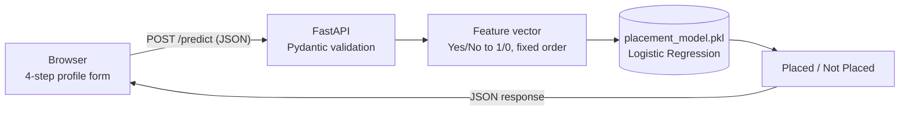

<div align="center">

# Internship Success Predictor

**Answer one question in under a minute: *how ready is my profile for placement?***

A machine-learning web app that reads a student's academic record, experience, aptitude and activities, and returns a **Placed / Not Placed** outlook, served by a FastAPI backend and wrapped in a cinematic, scroll-driven interface.

<br/>


<br/>

[Overview](#overview) · [Features](#features) · [How it works](#how-it-works) · [Quick start](#quick-start) · [API](#api-reference) · [Model](#model) · [Limitations](#known-limitations)

</div>

<!--
  Add a screenshot or GIF here once you have one, e.g. docs/preview.png, then uncomment:

  <p align="center">
    
  </p>
-->

---

## Overview

Campus placement outcomes depend on far more than a single grade. **Internship Success Predictor** takes ten signals about a student, trains a classifier on 10,000 historical records, and turns the result into a clear, friendly verdict through a guided four-step form.

- **Input:** CGPA, SSC and HSC marks, internships, projects, workshops/certifications, aptitude score, soft-skills rating, extracurricular activity, and placement training.
- **Output:** a `Placed` or `Not Placed` prediction, presented on an animated result card.
- **Model:** Logistic Regression, **80.85% accuracy** on a stratified hold-out set of 2,000 students.
- **Delivery:** one Python process serves both the API and the web interface. There is no separate frontend build step.

---

## Features

| | |
|---|---|
| **Guided 4-step profile** | Academic, Experience, Aptitude and Activities steps expand inline, with live *Pending / Complete* status, a filling connector line and a step progress bar. |
| **Cinematic hero** | Looping background video, floating particles, and a scroll-driven blur, zoom and fade that lets the form rise over the hero. |
| **Animated analysis** | A staged overlay (Academic, Experience, Readiness, Outlook) plays while the prediction request is in flight. |
| **Result card** | Animated gauge, an illustrative three-bar profile breakdown, outcome tags, and confetti on a *Placed* verdict. |
| **Typed API** | Pydantic schema with strict `Yes` / `No` enums; malformed requests are rejected with `422`. |
| **Safe local serving** | Only the HTML, CSS, JS and video are exposed through explicit routes, so the model file and source code are not publicly served. |
| **Responsive and accessible** | Layouts for desktop, tablet and phone (breakpoints at 1024, 768 and 480 px), plus ARIA live regions for progress and analysis states. |
| **One-click launch** | `start-project.bat` checks dependencies, installs anything missing, starts the server and opens the browser. |

---

## How it works



1. The student completes the four form steps in the browser.
2. `script.js` posts the ten values to `/predict`.
3. `main.py` validates them, encodes `Yes`/`No` as `1`/`0`, and builds the feature vector in the exact order the model was trained on.
4. The pickled scikit-learn model returns a class, and the API responds with `{"placement_status": "Placed" | "Not Placed"}`.
5. The UI renders the verdict.

---

## Tech stack

| Layer | Technology |
|---|---|
| Machine learning | scikit-learn (Logistic Regression), pandas, NumPy, joblib |
| Backend | FastAPI, Pydantic, Uvicorn |
| Frontend | HTML5, CSS3 (custom properties, glassmorphism), vanilla JavaScript |
| Typography | Playfair Display, Manrope, IBM Plex Mono, Caveat (Google Fonts) |
| Analysis | Jupyter Notebook |

---

## Dataset

`data/intership-succes-predictor.csv` contains **10,000 student records**, with no missing values.

| Feature | Type | Range in data | Meaning |
|---|---|---|---|
| `CGPA` | float | 6.5 – 9.1 | Cumulative grade point average (out of 10) |
| `Internships` | int | 0 – 2 | Internships completed |
| `Projects` | int | 0 – 3 | Projects completed |
| `Workshops/Certifications` | int | 0 – 3 | Workshops and certifications earned |
| `AptitudeTestScore` | int | 60 – 90 | Aptitude test score (out of 100) |
| `SoftSkillsRating` | float | 3.0 – 4.8 | Soft-skills rating (out of 5) |
| `ExtracurricularActivities` | Yes / No | n/a | Participates in extracurriculars |
| `PlacementTraining` | Yes / No | n/a | Completed a placement training program |
| `SSC_Marks` | int | 55 – 90 | Secondary school (SSC) marks, in percent |
| `HSC_Marks` | int | 57 – 88 | Higher secondary (HSC) marks, in percent |
| **`PlacementStatus`** | **target** | Placed / NotPlaced | Placement outcome |

**At a glance**

- **Class balance:** 4,197 placed (42.0%) and 5,803 not placed (58.0%).
- **Placement training matters in this data:** 51.6% of trained students were placed, against 15.6% of untrained students.

---

## Model

| Setting | Value |
|---|---|
| Algorithm | `LogisticRegression(max_iter=1000)` |
| Split | 80 / 20 train / test, `random_state=42`, stratified on the target |
| Features | 10 (`StudentID` dropped; `Yes`/`No` mapped to `1`/`0`) |
| Artifact | `placement_model.pkl`, saved with `joblib` |

### Test-set performance (2,000 students)

| Class | Precision | Recall | F1 | Support |
|---|---|---|---|---|
| Not Placed (0) | 0.84 | 0.83 | 0.83 | 1,161 |
| Placed (1) | 0.77 | 0.78 | 0.77 | 839 |
| **Accuracy** | | | **0.81** (0.8085) | 2,000 |
| Macro avg | 0.80 | 0.80 | 0.80 | 2,000 |

Confusion matrix (rows are the true class, columns the predicted class):

| | Predicted Not Placed | Predicted Placed |
|---|---|---|
| **Actually Not Placed** | 966 | 195 |
| **Actually Placed** | 188 | 651 |

### What drives the prediction

Standardised coefficients (features scaled to unit variance, so magnitudes are comparable). Larger positive values push the prediction toward *Placed*.

| Feature | Coefficient |
|---|---|
| Aptitude test score | +0.61 |
| Placement training | +0.39 |
| Extracurricular activities | +0.36 |
| SSC marks | +0.28 |
| Soft-skills rating | +0.26 |
| CGPA | +0.26 |
| Projects | +0.25 |
| HSC marks | +0.22 |
| Workshops / certifications | +0.10 |
| Internships | −0.01 |

These describe patterns in the dataset, not guarantees or causal advice.

<details>
<summary><b>Reproduce the coefficient table</b></summary>

<br/>

Run this after the train/test split cell in the notebook:

```python
from sklearn.preprocessing import StandardScaler
from sklearn.linear_model import LogisticRegression

scaler = StandardScaler().fit(X_train)
clf = LogisticRegression(max_iter=1000).fit(scaler.transform(X_train), y_train)

for name, coef in sorted(zip(X_train.columns, clf.coef_[0]), key=lambda t: -abs(t[1])):
    print(f"{name:28s}{coef:+.2f}")
```

</details>

---

## Quick start

**Requirements:** Python 3.11 or newer.

### Windows: one click

Double-click **`start-project.bat`**. It will:

1. Check that the required packages are installed, and install them from `requirements.txt` if not.
2. Start the server at `http://127.0.0.1:8000`.
3. Open the app in your default browser.

### Any OS: manual setup

```bash
# 1. Clone
git clone https://github.com/<your-username>/internship-success-predictor.git
cd internship-success-predictor

# 2. Create and activate a virtual environment
python -m venv .venv
source .venv/bin/activate          # Windows: .venv\Scripts\activate

# 3. Install dependencies
pip install -r requirements.txt

# 4. Run
uvicorn main:app --reload
```

Then open **http://127.0.0.1:8000**. Interactive API docs are available at **http://127.0.0.1:8000/docs**.

### Using the app

1. Click **Get Started** and scroll to your profile.
2. Complete the four steps: Academic, Experience, Aptitude, Activities.
3. Press **Assess Candidate**.
4. Read your outlook on the result card.

---

## API reference

### `POST /predict`

Returns the model's placement prediction for one student.

**Request body** (`application/json`)

| Field | Type | Notes |
|---|---|---|
| `CGPA` | number | Out of 10 |
| `Internships` | integer | Count |
| `Projects` | integer | Count |
| `WorkshopsCertifications` | integer | Count |
| `AptitudeTestScore` | integer | Out of 100 |
| `SoftSkillsRating` | number | Out of 5 |
| `ExtracurricularActivities` | `"Yes"` \| `"No"` | |
| `PlacementTraining` | `"Yes"` \| `"No"` | |
| `SSC_Marks` | integer | Percent |
| `HSC_Marks` | integer | Percent |

**Example**

```bash
curl -X POST http://127.0.0.1:8000/predict \
  -H "Content-Type: application/json" \
  -d '{
    "CGPA": 8.5,
    "Internships": 2,
    "Projects": 3,
    "WorkshopsCertifications": 2,
    "AptitudeTestScore": 85,
    "SoftSkillsRating": 4.5,
    "ExtracurricularActivities": "Yes",
    "PlacementTraining": "Yes",
    "SSC_Marks": 80,
    "HSC_Marks": 82
  }'
```

**Response**

```json
{ "placement_status": "Placed" }
```

**Errors:** a wrong type or a value other than `Yes` / `No` returns `422 Unprocessable Entity` with details. The API validates types and enums; numeric range limits (for example CGPA 0 to 10) are enforced by the form in the browser.

### Other routes

| Route | Purpose |
|---|---|
| `GET /` | Web interface |
| `GET /docs` | Interactive Swagger UI |
| `GET /style.css`, `/script.js`, `/hero-background.mp4` | Frontend assets |

---

## Project structure

```text
internship-success-predictor/
├── data/
│   └── intership-succes-predictor.csv   # 10,000-record training dataset
├── 01_explore_data.ipynb                # EDA, preprocessing, training, evaluation
├── main.py                              # FastAPI app: /predict + static routes
├── placement_model.pkl                  # Trained Logistic Regression model
├── index.html                           # Interface markup
├── style.css                            # Design system and animations
├── script.js                            # Form logic, API calls, result rendering
├── hero-background.mp4                  # Hero background video
├── requirements.txt                     # Pinned dependencies
├── start-project.bat                    # Windows one-click launcher
└── .gitignore
```

---

## Retraining the model

1. Open `01_explore_data.ipynb` in Jupyter or VS Code.
2. Run all cells. The notebook loads the CSV, encodes the categorical columns, splits the data, trains the model, prints the evaluation, and saves `placement_model.pkl`.
3. Restart the server.

> **Path note:** the notebook reads the CSV with a Windows-style path (`data\intership-succes-predictor.csv`). On macOS or Linux, change it to `data/intership-succes-predictor.csv`.

> **Feature order matters.** `main.py` builds the input vector in this exact order, matching training. If you add, remove or reorder features, update both the notebook and the `/predict` handler:
>
> `CGPA, Internships, Projects, Workshops/Certifications, AptitudeTestScore, SoftSkillsRating, ExtracurricularActivities, PlacementTraining, SSC_Marks, HSC_Marks`

> **Version note:** pickled scikit-learn models are sensitive to library versions. Keep `scikit-learn` pinned as in `requirements.txt`, or retrain the model in your own environment.

---

## Known limitations

Being upfront about what this project is, and is not:

- **The gauge percentage is illustrative.** The verdict (`Placed` / `Not Placed`) comes from the model, but the percentage on the gauge and the three profile bars (Academic, Experience, Readiness) are computed in the browser and are not calibrated model probabilities.
- **Narrow training ranges.** The data covers CGPA 6.5 to 9.1, aptitude 60 to 90, and at most 2 internships, 3 projects and 3 certifications. Inputs far outside these ranges are extrapolation.
- **Baseline model.** A single Logistic Regression on one train/test split, with no cross-validation or hyperparameter tuning yet.
- **Proxy target.** The label is `PlacementStatus`, used here as a stand-in for placement and internship readiness.
- **Open CORS for local use.** `main.py` allows all origins (`*`). Restrict this before any public deployment.

This is a decision-support and learning tool. It should not be used as the sole basis for real hiring or academic decisions.

---

## Roadmap

- [ ] Return real class probabilities via `predict_proba` and drive the gauge from them
- [ ] Cross-validation and a model comparison (Random Forest, XGBoost)
- [ ] Per-prediction explanations with SHAP
- [ ] Server-side range validation in the Pydantic schema
- [ ] Automated tests for the API and the preprocessing path
- [ ] Docker image and a hosted demo
- [ ] Preview screenshot or GIF in this README

---

## Author

Built by **Nilay** · B.Tech CSE/IT, Haldia Institute of Technology, West Bengal.

Suggestions, issues and pull requests are welcome.

---

<div align="center">

Built with FastAPI, scikit-learn, and a lot of CSS.

</div>
